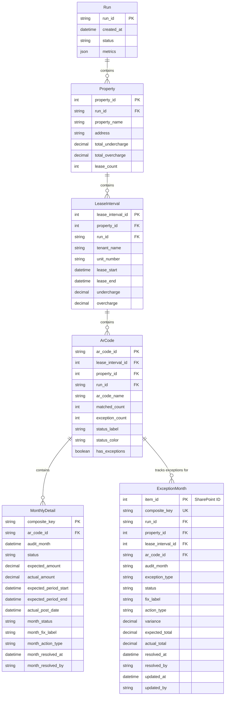

# Lease File Audit - Data Model

## Entity Relationship Diagram



## Entity Descriptions

### Run
Represents a complete audit execution cycle. Each run analyzes multiple properties and generates reconciliation reports.
- **Storage**: Local filesystem (`instance/runs/run_YYYYMMDD_HHMMSS/`)
- **Key Fields**: `run_id` (unique identifier with timestamp)

### Property
A real estate property within an audit run. Contains multiple lease intervals.
- **Storage**: Local filesystem (within run directory)
- **Parent**: Run
- **Children**: LeaseInterval records

### LeaseInterval
A specific tenant lease at a property. Contains AR codes to be reconciled.
- **Storage**: Local filesystem (within run directory)
- **Parent**: Property
- **Children**: ArCode records
- **Key Fields**: `lease_interval_id`, `tenant_name`, `unit_number`

### ArCode
An accounting receivable code (charge type) within a lease. Examples: RENT, PET, PARKING, etc.
- **Storage**: Local filesystem (within run directory)
- **Parent**: LeaseInterval
- **Children**: MonthlyDetail records, ExceptionMonth records
- **Status Calculation**: Derived from ExceptionMonth records
  - **Passed**: No exceptions found (`exception_count = 0`)
  - **Open**: Has exceptions, not all resolved
  - **Resolved**: All exception months have fixes applied

### MonthlyDetail
Month-by-month comparison of expected vs actual charges for an AR code.
- **Storage**: Local filesystem (within run directory)
- **Parent**: ArCode
- **Key Fields**: `audit_month`, `status` (matched/exception), amounts

### ExceptionMonth
**Critical persistence layer** - Tracks resolution status for individual exception months in SharePoint.
- **Storage**: SharePoint List (`ExceptionMonths`)
- **Purpose**: 
  - Enables granular month-level exception tracking
  - Persists fix decisions across app restarts
  - Allows collaboration between multiple users
  - Drives AR code status calculation
- **Parent**: ArCode
- **Key Fields**: 
  - `composite_key`: Unique identifier (run:property:lease:ar_code:month)
  - `status`: "Open" or "Resolved"
  - `fix_label`: Which fix was applied
  - `resolved_by`, `resolved_at`: Audit trail

## Data Flow

### Audit Execution
1. **Run created** → Generates unique `run_id`
2. **Properties loaded** → From Entrata/Excel data
3. **LeaseIntervals extracted** → From property data
4. **ArCodes identified** → For each lease
5. **MonthlyDetails calculated** → Compare expected vs actual transactions
6. **Exceptions detected** → Stored in MonthlyDetail records

### Exception Resolution Workflow
1. **User opens lease** → Views ArCode with exceptions
2. **User applies fix to month(s)** → JavaScript calls `/api/exception-months` (POST)
3. **ExceptionMonth saved to SharePoint** → Creates/updates record with fix details
4. **Status recalculated** → Backend queries all ExceptionMonth records
5. **Badge updated** → UI reflects new status (Open → Resolved when all months fixed)

### Status Calculation Logic
```python
# storage/service.py - calculate_ar_code_status()
if exception_count == 0:
    status = "Passed"  # No exceptions found
elif all months have fixes:
    status = "Resolved"  # All exceptions addressed
else:
    status = "Open (X of Y resolved)"  # Partial progress
```

## Storage Architecture

### Local Filesystem
- **Location**: `instance/runs/run_YYYYMMDD_HHMMSS/`
- **Format**: JSON, CSV
- **Contents**: Run, Property, LeaseInterval, ArCode, MonthlyDetail
- **Scope**: Single audit run, read-only after creation

### SharePoint Lists
- **List**: `ExceptionMonths`
- **Format**: SharePoint List Items (via Microsoft Graph API)
- **Contents**: ExceptionMonth records
- **Scope**: Cross-run, multi-user, persisted resolution states
- **Indexed Columns**: `RunId`, `PropertyId`, `LeaseIntervalId`, `ArCodeId` (for efficient filtering)

## Key Relationships

- **Run → Property**: 1:Many
- **Property → LeaseInterval**: 1:Many  
- **LeaseInterval → ArCode**: 1:Many
- **ArCode → MonthlyDetail**: 1:Many (audit comparison data)
- **ArCode → ExceptionMonth**: 1:Many (resolution tracking)

## Composite Keys

### MonthlyDetail
`run_id:property_id:lease_interval_id:ar_code_id:audit_month`

### ExceptionMonth
`run_id:property_id:lease_interval_id:ar_code_id:audit_month`

Both use the same key structure to link resolution states to specific monthly details.
